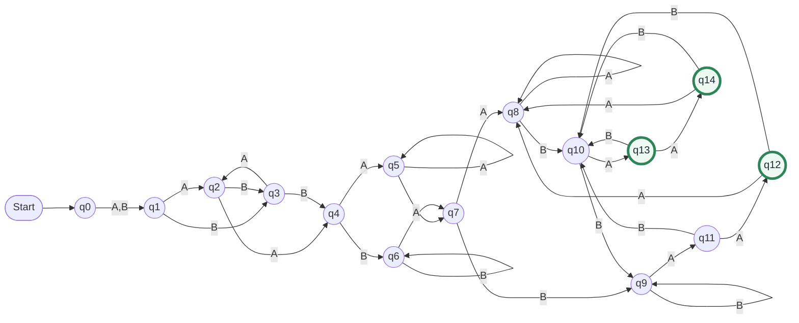
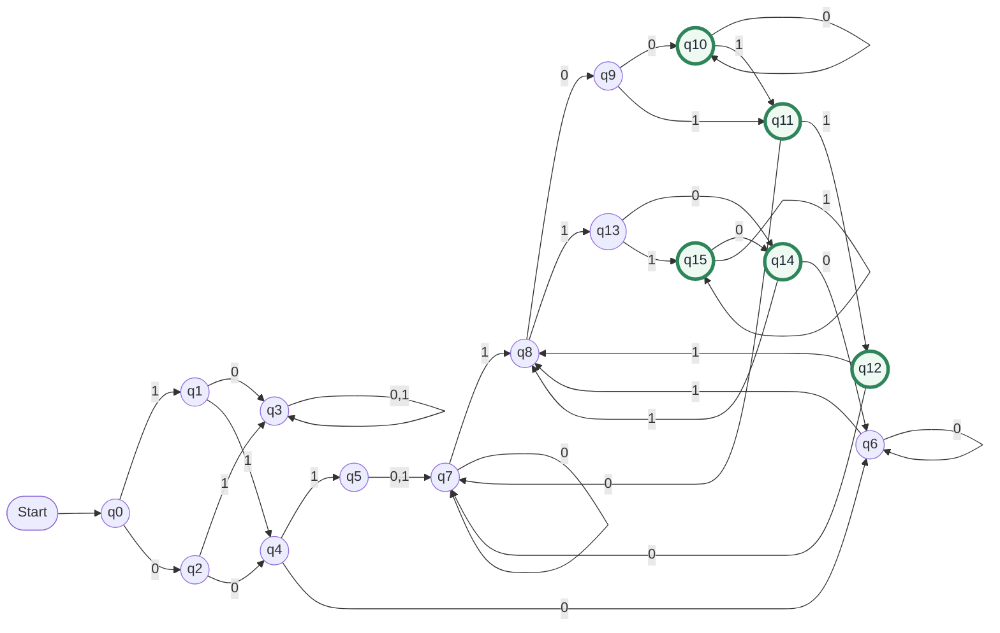

# DFA Flowcharts

## DFA 1

```mermaid
flowchart LR
    %% DFA 1
    start1([Start]) --> q0((q0))

    q0 -->|A,B| q1((q1))
    q1 -->|A| q2((q2))
    q1 -->|B| q3((q3))
    q2 -->|A| q4((q4))
    q2 -->|B| q3
    q3 -->|A| q2
    q3 -->|B| q4
    q4 -->|A| q5((q5))
    q4 -->|B| q6((q6))
    q5 -->|A| q5
    q5 -->|B| q7((q7))
    q6 -->|A| q7
    q6 -->|B| q6
    q7 -->|A| q8((q8))
    q7 -->|B| q9((q9))
    q8 -->|A| q8
    q8 -->|B| q10((q10))
    q9 -->|A| q11((q11))
    q9 -->|B| q9
    q10 -->|A| q13((q13))
    q10 -->|B| q9
    q11 -->|A| q12((q12))
    q11 -->|B| q10
    q12 -->|A| q8
    q12 -->|B| q10
    q13 -->|A| q14((q14))
    q13 -->|B| q10
    q14 -->|A| q8
    q14 -->|B| q10

    classDef accept fill:#eef9f1,stroke:#2f855a,stroke-width:4px,color:#1f2937;
    class q12,q13,q14 accept;
```

Accepting states: `q12`, `q13`, `q14`

## DFA 2

```mermaid
flowchart LR
    %% DFA 2
    start2([Start]) --> q0((q0))

    q0 -->|1| q1((q1))
    q0 -->|0| q2((q2))
    q1 -->|0| q3((q3))
    q1 -->|1| q4((q4))
    q2 -->|1| q3
    q2 -->|0| q4
    q3 -->|0,1| q3
    q4 -->|1| q5((q5))
    q4 -->|0| q6((q6))
    q5 -->|0,1| q7((q7))
    q6 -->|1| q8((q8))
    q6 -->|0| q6
    q7 -->|1| q8
    q7 -->|0| q7
    q8 -->|0| q9((q9))
    q8 -->|1| q13((q13))
    q9 -->|0| q10((q10))
    q9 -->|1| q11((q11))
    q10 -->|0| q10
    q10 -->|1| q11
    q11 -->|0| q7
    q11 -->|1| q12((q12))
    q12 -->|0| q7
    q12 -->|1| q8
    q13 -->|0| q14((q14))
    q13 -->|1| q15((q15))
    q14 -->|0| q6
    q14 -->|1| q8
    q15 -->|0| q14
    q15 -->|1| q15

    classDef accept fill:#eef9f1,stroke:#2f855a,stroke-width:4px,color:#1f2937;
    class q10,q11,q12,q14,q15 accept;
```

Accepting states: `q10`, `q11`, `q12`, `q14`, `q15`
